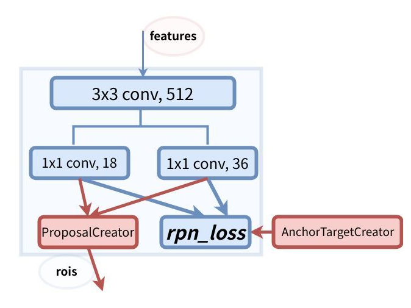
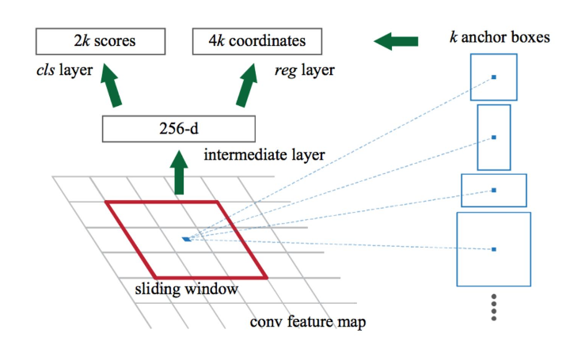
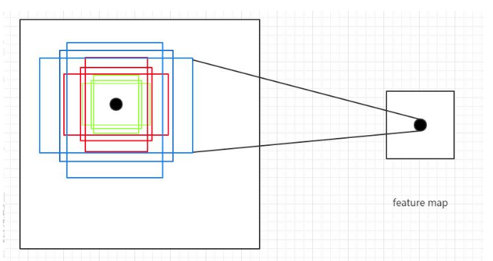
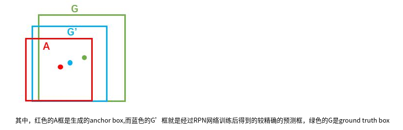
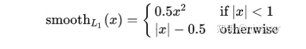

## Faster RCNN 网络复现笔记

- Faster RCNN 网络算法流程概览

	
    
    - 算法流程框图

		
        
- 代码实现思路

	读取图像数据和标签，经过网络处理后处理得到预测结果，计算预测结果和标签的损失进行模型更新
    
	- 数据加载 data_loader 

		该模块实现 coco 数据集的图片标签读取功能，实现 **Dataset** 和 **DataLoader** 两个类，借助 **pycocotools** 实现了 **CoCo** 数据集读取，并使用cv2显示
        
        Dataset类 是 Pytorch 中图像数据集中最为重要的一个类，也是 Pytorch 中所有数据集加载类中应该继承的父类。其中父类中的两个私有成员函数必须被重载，否则将会触发错误提示：
	```python
     def  __getitem__(self, index):
    def  __len__(self):
    ```  
其中\_\_len\_\_应该返回数据集的大小，而\_\_getitem\_\_应该编写支持数据集索引的函数

	实现图像的resize 和 letterbox，在对图片进行resize时，保持原图的长宽比进行等比例缩放，当长边 resize 到需要的长度时，短边剩下的部分采用灰色填充

 - Backbone 网络

	选择 ResNet50 作为backbone 网络
    
    - 输入图像 $[1,3,416,416]$
    
    - 生成中间 feature map 输出大小 $[1, 1024, 26, 26]$

	- 下采样率 为 $416 / 26 =  16$

		基于感受野的概念，表示特征图上 每个点 $1 \times1 $ 代表了 原图  $16 \times 16 $ 的大小区域，该区域的特征信息存放在 特征 $1024$ 维度中

  - RPN 网络

       五个基本模块：

      - Anchor 生成模块

        对 feature map 的每个点 生成 固定 9 种 anchor，生成格式为 ** 中心点坐标 + [w, h]** 的格式，注意到这些中心点坐标是在 **特征图** 上的。
        
        anchor 数量： $26  \times 26 \times 9$

        Anchor 的尺寸设计：

        sclae: $[8,16,32]$

        ratio: $[0.5,1,2]$

    -  RPNNet

        首先使用$3 \times 3$卷积对特征图进行特征融合，然后使用 $1 \times 1$ 的卷积网络计算出每一个 Anchor 的预测得分和 位置偏移量  

        

         

    - 生成 Proposal

         1. 将 Anchor 反算到 原图尺寸的坐标（中心点坐标直接乘以下采样率）

			 
         2. 依据 RPNNet 输出的偏移量$[t_x,t_y,t_w,t_h]$作用在 anchor $[x_a, y_a, w_a, h_a]$上，得到 proposal 的坐标 $[x^\star, y^\star, w^\star, h^\star]$，这一步中需要对 proposal 进行剪裁，保证 proposal 合法

			$$x^ \star = w_a * t_x + x_a$$
            $$y^ \star = h_a * t_y + y_a$$
            $$w^ \star = w_a * e^{t_w}$$
            $$h^ \star = h_a * e^{t_h}$$
            
         3. 筛选高质量 proposal

			-   按照 proposal 对应的得分，筛选 前 12000 个 proposal
			-   使用 NMS 筛选重合的 proposal
			-   继续按照 得分筛选前 2000 个 proposal
            
    - 筛选 proposal 得到 ROI（训练阶段）       

		这一步骤实际上是筛选正负样本
        
        - 计算 proposal 与所有 标签框 的 IoU 矩阵
        - 有以下原则：（顺序不可改变）
        	- 一个 proposal ，与所有标签框 IoU < 0.3 ，则为负样本
        	- 任何一个标签框，与其有最大 IoU 的 proposal 为正样本
        	- 任何一个 proposal，与所有标签的最大 IoU > 0.7，为正样本

			允许多个 proposal 对应一个 标签，不允许一个标签 对应多个 proposal

		- 控制 正负样本比例为 $1:3$

			主要通过随机筛选获得

   - rpn 损失计算（训练阶段）

        第一阶段对 预测框的 类别 （是否存在物体）学习以及 位置粗修

        - 依据上步骤获取正负样本

		- 针对正负样本计算损失

			 
             
             - 正负样本的类别损失计算，正样本标签为 1，负样本标签为 0，记为 $P_i$ ，两者预测值为 RPNNet 的输出预测值 为 $P^\star_i$

			交叉熵损失
            
            $$L_{cls}[P_i, P^\star_i] = \frac {1}{N_{cls}} \sum_{i=0}^{N_{cls}}L_{cls}(p_i, p_i^\star)$$
            
            $$L_{cls} = -log [p_i * p_i^\star + (1-p_i) *( 1 - p_i^\star)]$$
            
          - 位置损失

			- 标签$[t_x,t_y,t_w,t_h]$计算，已知 标签框$ [x,y,w,h]$， 以及对应的预测框 proposal $[x_a,y_a,w_a,h_a]$

				$$t_x = \frac {(x-x_a)}{w_a}$$
                $$t_y = \frac {(y-y_a)}{h_a}$$
                $$t_w = log (w/w_a)$$
                $$t_h = log (h/h_a)$$
                
                令 $t = [t_x, t_y, t_w, t_h]$
                
                $$L_{reg} = \lambda \frac {1} {N_{reg}} \sum_{i} p_i L_{reg}(t_i, t_i^\star)$$
                
                $$L_{reg}(t_i, t_i^\star) = \sum_{i \in x,y,w,h} smooth_{L1}(t_i - t_i^\star)$$
				
                 