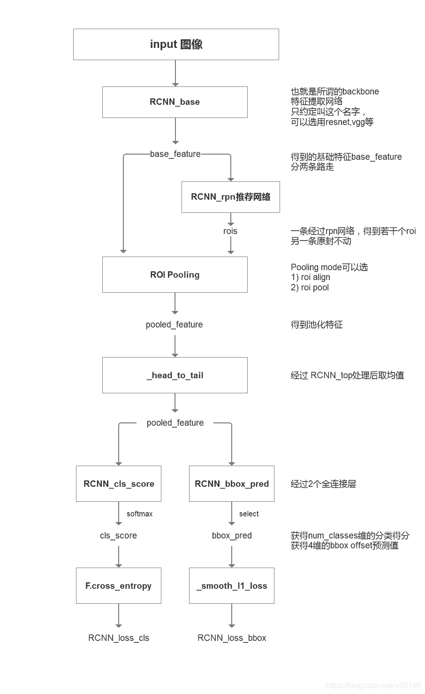

## Faster RCNN 网络复现笔记

- Faster RCNN 网络算法流程概览

	
    
    - 算法流程框图

		
        
- 代码实现思路

	读取图像数据和标签，经过网络处理后处理得到预测结果，计算预测结果和标签的损失进行模型更新
    
	- 数据加载 data_loader 

		该模块实现 coco 数据集的图片标签读取功能，实现 **Dataset** 和 **DataLoader** 两个类，借助 **pycocotools** 实现了 **CoCo** 数据集读取，并使用cv2显示
        
        Dataset类 是 Pytorch 中图像数据集中最为重要的一个类，也是 Pytorch 中所有数据集加载类中应该继承的父类。其中父类中的两个私有成员函数必须被重载，否则将会触发错误提示：
	```python
     def  __getitem__(self, index):
    def  __len__(self):
    ```  
其中\_\_len\_\_应该返回数据集的大小，而\_\_getitem\_\_应该编写支持数据集索引的函数

	实现图像的resize 和 letterbox，在对图片进行resize时，保持原图的长宽比进行等比例缩放，当长边 resize 到需要的长度时，短边剩下的部分采用灰色填充

 - backbone 网络

	选择 ResNet50 作为backbone 网络

